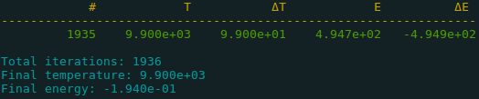

# Generic Simulated Annealing #

[](https://opensource.org/licenses/MIT)
[](https://travis-ci.org/charlybigoud/gsa)

gsa is an C++ optimization library based on the simulated annealing algorithm. This code was develop following the algorithm's description in the [wikipedia page](https://en.wikipedia.org/wiki/Simulated_annealing).

## Dependencies ##
* linux
* g++ >= 5.1
* C++14 (`-std=c++1y`).

## Building ##
```
git clone git@github.com:charlybigoud/gsa.git
cd gsa
mkdir build
cd build
cmake ..
make -j
```

## Usage ##
_SimulatedAnnealing_ is defined by 5 parameters:
* a start temperature (default value : $$1e3$$)
* a stop temperature (default value : $$0$$)
* a number of iteration per temperature step (default value : $$1e3$$)
* the minimal energy required to stop (default value : $$0$$)
* the $$\alpha$$ value to set the new temperature at each step according to $$T_{new} = \alpha \cdot T_{previous}$$ (default value : $$0.99$$)

The algorithm needs:
* a _State_ to optimize
* an _Energy_ function
* a state _Generator_

The _State_ can be defined as a variable, a `struct` or a `class`. The other elements can be a `lambda`, a `struct` or a `class`.
Once you have defined your system you can run the optimization using `SimulatedAnnealing::operator()`.

To see some usage, please refer to the examples.

### Interface: ###



* _#_ the iteration number
* T the actual temperature
* $$\Delta$$T the difference between the previous and the actual temperature
* E the actual energy
* $$\Delta$$E the difference between the previous and the actual energy

If the actual state satisfies the Metropolis criteria, the line is green printed otherwise it is red printed.
At the end of the optimization, the total number of iterations, the final temperature and the minimal energy are displayed.

## Issues ##

Please visit [Github Issues](https://github.com/charlybigoud/gsa/issues) to view and report problems with gsa. Issues and pull requests should be raised against the master branch.
